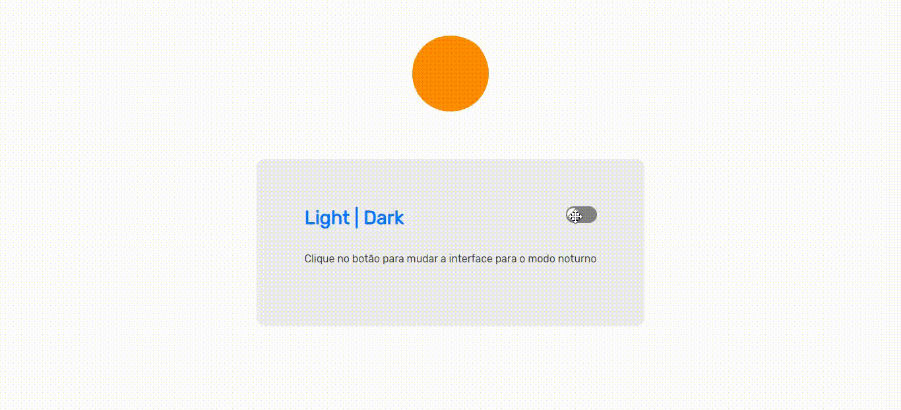

<h1>
Dark Mode com CSS Variables e JavaScrip
</h1>
<h1 aling="center">

</h1>

---

## Sobre:

Projeto desenvolvido em conjunto com o professor *Mayk Brito* da *Rocketseat* com o objetivo de reprodusir o a mudanças de variaveis no CSS através do JavaScrip ao clicar em um checkbox

---

## Ferramentas Ultilizadas:

- HTML;
- CSS;
- JavaScrip;